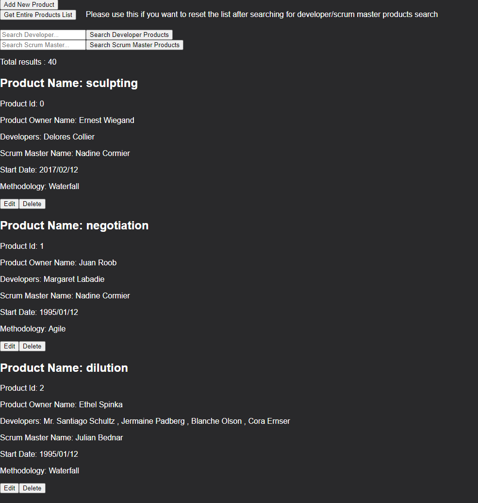

Create/Search/Delete/Edit data through various API calls communicating with a mock data backend.

# AURLIN-DHILLON-IS24-full-stack-competition-req97073

## Final Product

## Notes

Frontend: React.

Backend: Nodejs, Express.

Virtualization: Docker.

There is a deprecation warning that is still pending to be fixed from my research after running the Docker compile.

Frontend runs on http://localhost:3008/

Backend runs on http://localhost:3000/api/

GET http://localhost:3000/api/products

GET specific http://localhost:3000/api/products/:productId

POST endpoint http://localhost:3000/api/products

PUT http://localhost:3000/api/products/:productId

DELETE http://localhost:3000/api/products/:productId

Health API is http://localhost:3000/api/healthcheck

## Getting Started

1. Clone repository.
2. CD into frontend subfolder, run `npm install`
3. CD into backend subfolder, run `npm install`
4. Run `docker-compose up` in main directory where docker-compose.yaml is present
5. Go to frontend link which is http://localhost:3008/
6. Swagger docs at http://localhost:3000/api/api-docs
